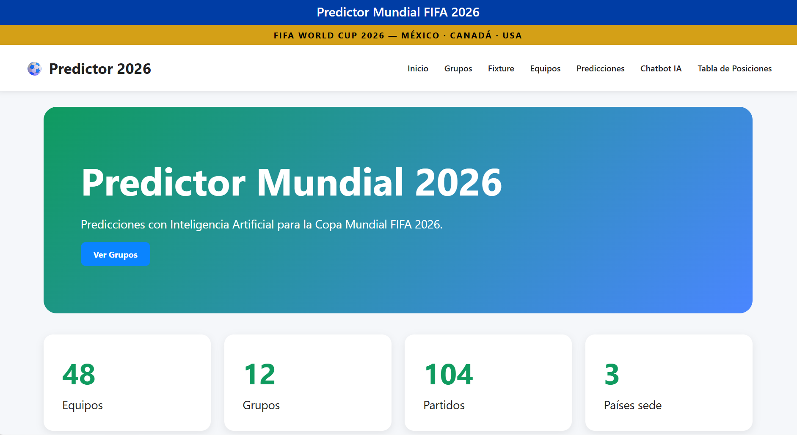
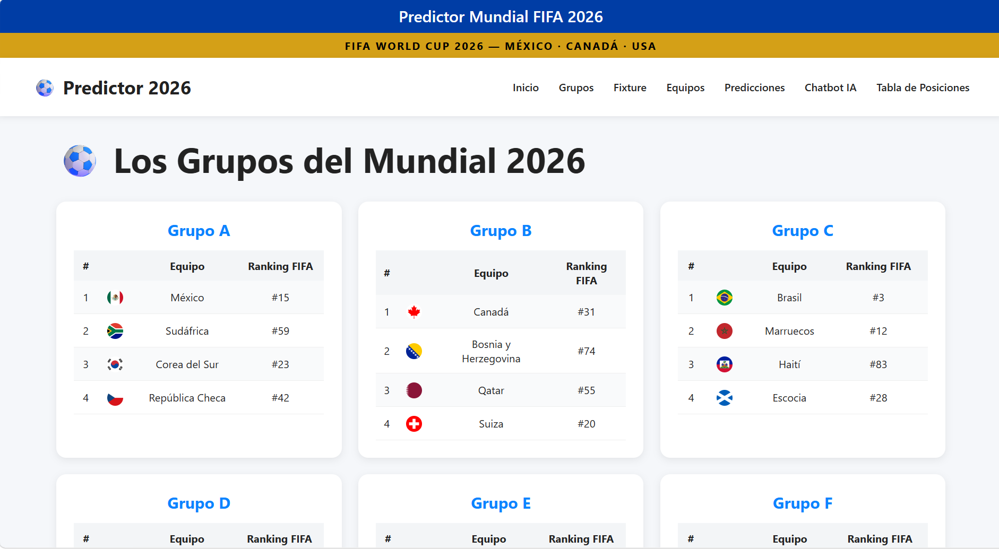
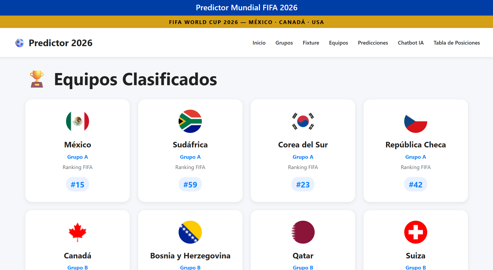
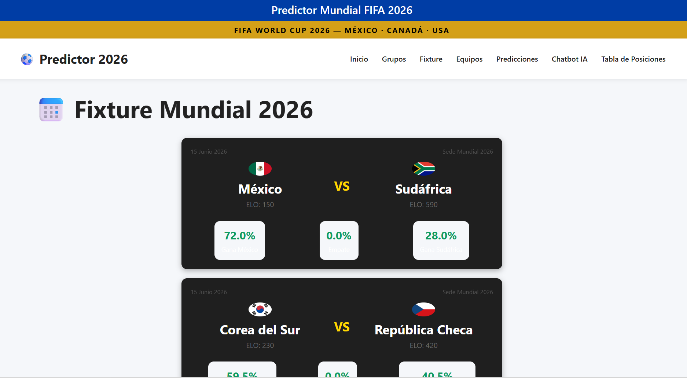
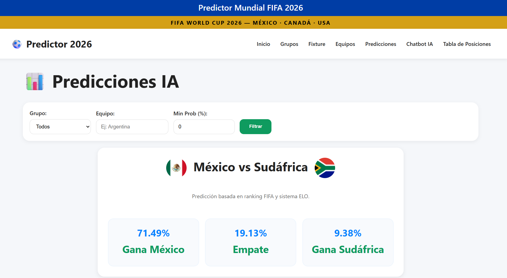
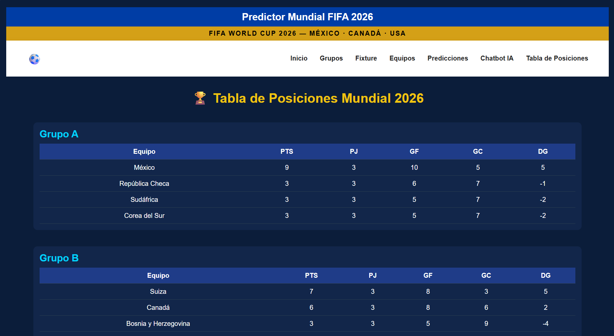
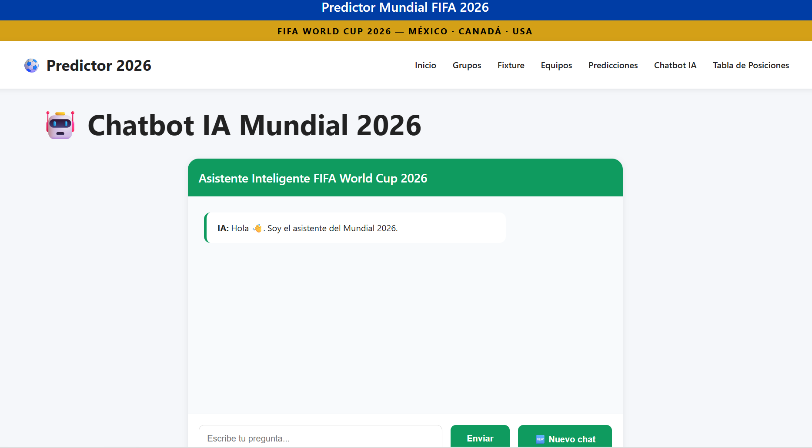

# 🏆Predictor Mundial FIFA 2026

Aplicación web desarrollada con Flask e Inteligencia Artificial para simular y analizar el Mundial FIFA 2026.

El sistema permite consultar grupos, equipos participantes, fixture, estadísticas históricas, predicciones de partidos mediante Machine Learning y realizar consultas a través de un chatbot inteligente.

---

# 🚀Características

* Visualización de grupos del Mundial 2026.
* Consulta de equipos participantes.
* Fixture completo del torneo.
* Predicción automática de resultados.
* Tabla de posiciones simulada.
* Estadísticas de rendimiento de selecciones.
* Base de datos SQLite para almacenamiento.
* Chatbot con respuestas sobre el torneo.
* Interfaz web responsiva.
* Sistema de banderas para cada selección.

---

# 🛠️Tecnologías utilizadas

- **Lenguaje:** Python 3
- **Backend:** Flask
- **Base de datos:** SQLite
- **Data:** pandas, numpy
- **Machine Learning:** scikit-learn, joblib
- **HTTP / Requests:** requests
- **Frontend:** HTML5, CSS3, JavaScript

---

# Capturas de pantalla

Guarda las capturas de pantalla en la carpeta `screenshots/` y utiliza los siguientes nombres sugeridos:

- `inicio.png`
- `grupos.png`
- `equipos.png`
- `fixture.png`
- `predicciones.png`
- `estadisticas.png`
- `chatbot.png`

### Página principal


### Grupos


### Equipos


### Fixture


### Predicciones


### Estadísticas


### Chatbot

```

mundial_app/
│
├── app.py
├── model.py
├── model.pkl
├── mundial.db
├── results.csv
│
├── static/
│   ├── css/
│   └── img/
│
├── templates/
│   ├── base.html
│   ├── index.html
│   ├── inicio.html
│   ├── grupos.html
│   ├── equipos.html
│   ├── fixture.html
│   ├── predicciones.html
│   ├── tabla.html
│   ├── estadisticas.html
│   └── chatbot.html
│
├── crear_bd.py
├── guardar_predicciones.py
├── aplicar_predicciones_heuristicas.py
├── download_flags.py
│
├── DOCS.md
├── requirements.txt
├── screenshots/
│   ├── inicio.png
│   ├── grupos.png
│   ├── fixture.png
│   └── equipos.png
│   ├── predicciones.png
│   └── chatbot.png
    └── tabla de posiciones.png   
└── README.md

```

---

# ⚙️Instalación

## 1. Clonar repositorio

```bash
git clone URL_DEL_REPOSITORIO
```

## 2. Entrar al proyecto

```bash
cd mundial_app
```

## 3. Crear entorno virtual

```bash
python -m venv .venv
```

## 4. Activar entorno

Windows:

```bash
.venv\Scripts\activate
```

## 5. Instalar dependencias

```bash
pip install -r requirements.txt
```

## 6. Ejecutar aplicación

```bash
python app.py
```

## 7. Abrir navegador

```text
http://127.0.0.1:5000
```

---

# Modelo de Machine Learning

El sistema utiliza un modelo de clasificación entrenado con resultados históricos de partidos internacionales.

Dataset utilizado:

International Football Results Dataset

https://kaggle.com/datasets/martj42/international-football-results-from-1872-to-2017

El modelo genera predicciones de resultados que posteriormente son utilizadas para construir tablas de posiciones y simulaciones del torneo.


---

# 👥Integrantes

* Jaquelin Natalia Lorenzana León
* Salvador André Martínez Juárez

---

# Universidad

Universidad Mariano Gálvez de Guatemala

Curso: Inteligencia Artificial

---

# Estado del proyecto

Proyecto funcional desarrollado como parte de la evaluación final del curso de Inteligencia Artificial, integrando Machine Learning, base de datos y desarrollo web.

